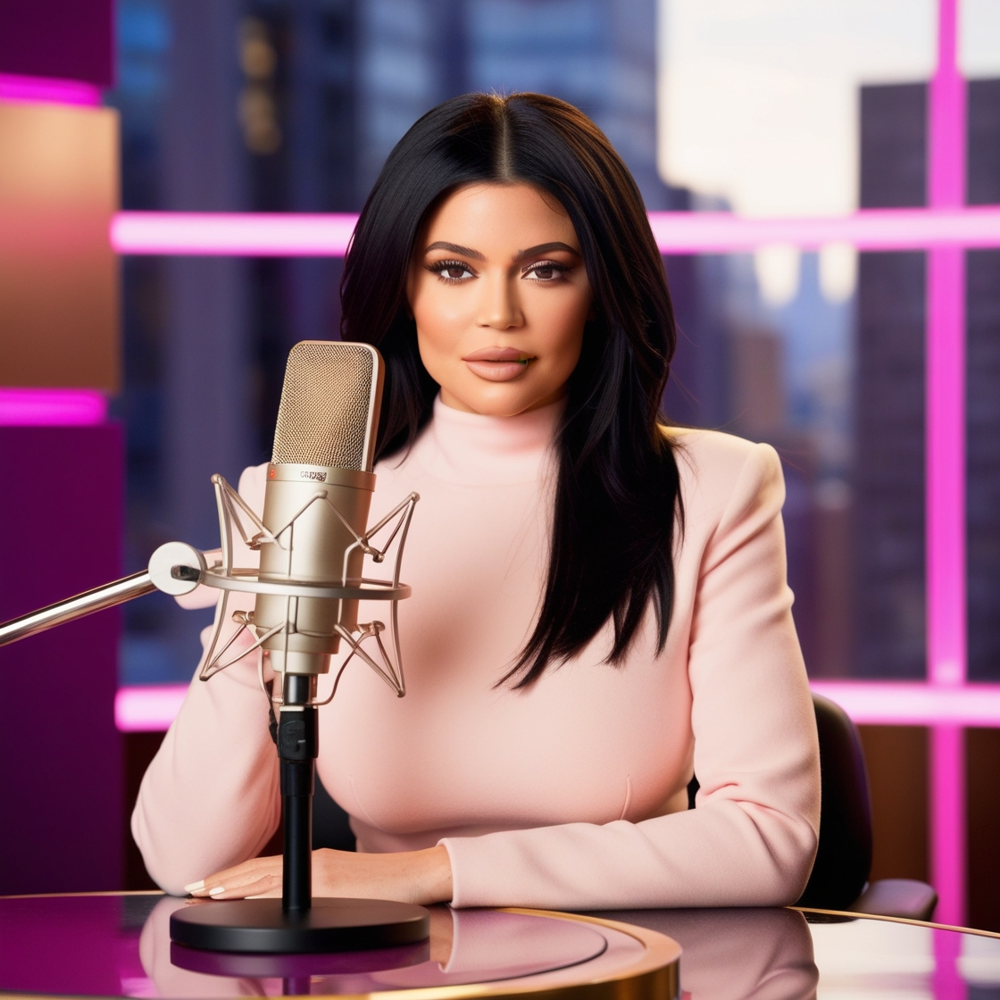

# Natural ou Fake Natty? Como Vencer na Era das IAs Generativas

### Template

```markdown
# PodKhy

## 📒 Descrição
Este projeto trata-se de mais uma das marcas da magnata Kylie Jenner! Após anos de experiência em frente às câmeras, desta vez,
a empresária decidiu criar o seu proóprio podcast, para se divertir em conversas com suas celebridades amigas!

## 🤖 Tecnologias Utilizadas
Imagem: https://leonardo.ai/
Nome: https://chatgpt.com/

## 🧐 Processo de Criação
Utilizei o "Leonardo AI" para criar a imagem através de um prompt detalhado e, em seguida, o "ChatGPT"
para sugerir um nome criativo para a marca.

## 🚀 Resultados


## 💭 Reflexão
Por mais simples que o projeto seja, a IA possui um poder muito grande, possibilitando diversas formas de aplicações e
podendo oferecer diversos resultados.
```

